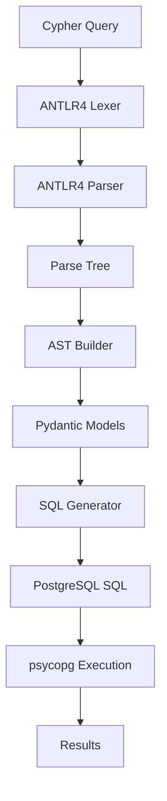

# Architecture

This document describes the internal architecture and design decisions of PGraf Cypher.

## Overview

PGraf Cypher follows a multi-stage translation pipeline that converts Cypher queries into PostgreSQL SQL:



## Core Components

### 1. ANTLR4 Grammar (`pgraf_cypher/antlr/`)

The foundation of the parser is an ANTLR4 grammar that defines Cypher syntax:

```antlr
// Cypher25Parser.g4 (simplified)
statement
    : matchClause returnClause
    | matchClause whereClause returnClause
    | matchClause whereClause returnClause orderClause
    | matchClause whereClause returnClause orderClause limitClause
    ;

matchClause
    : 'MATCH' patternList
    ;

patternList
    : pattern (',' pattern)*
    ;

pattern
    : nodePattern (relationshipPattern nodePattern)*
    ;

nodePattern
    : '(' variable? labelExpression? properties? ')'
    ;
```

**Key Features:**
- Supports Cypher 2.5 syntax subset
- Handles complex pattern matching
- Manages operator precedence
- Provides error recovery

### 2. AST Models (`pgraf_cypher/models.py`)

Pydantic models represent the abstract syntax tree:

```python
class Query(BaseModel):
    """Root query model containing all clauses."""
    clauses: List[Union[MatchClause, WhereClause, ReturnClause, ...]]

class MatchClause(BaseModel):
    """MATCH clause with patterns."""
    patterns: List[Pattern]

class Pattern(BaseModel):
    """Graph pattern (nodes and relationships)."""
    elements: List[Union[NodePattern, RelationshipPattern]]

class NodePattern(BaseModel):
    """Node pattern: (variable:Label {properties})"""
    variable: Optional[str] = None
    labels: List[str] = Field(default_factory=list)
    properties: Dict[str, Any] = Field(default_factory=dict)

class RelationshipPattern(BaseModel):
    """Relationship pattern: -[variable:TYPE {properties}]->"""
    variable: Optional[str] = None
    labels: List[str] = Field(default_factory=list)
    properties: Dict[str, Any] = Field(default_factory=dict)
    direction: Literal["->", "<-", "--"] = "--"
    min_length: Optional[int] = None
    max_length: Optional[int] = None
```

**Design Principles:**
- **Immutable**: Models are frozen after creation
- **Type-safe**: Full mypy compatibility
- **Validating**: Automatic validation via Pydantic
- **Serializable**: Can be converted to/from JSON

### 3. Parse Tree Visitor (`pgraf_cypher/parsers.py`)

Converts ANTLR parse trees to Pydantic models:

```python
class CypherToModelsVisitor(antlr4.ParseTreeVisitor):
    """Visitor that converts parse trees to Pydantic models."""

    def __init__(self):
        self.variables = {}  # Track variable bindings
        self.parameter_count = 0

    def visitStatement(self, ctx) -> Query:
        clauses = []
        for child in ctx.children:
            if hasattr(self, f'visit{type(child).__name__}'):
                clause = self.visit(child)
                if clause:
                    clauses.append(clause)
        return Query(clauses=clauses)

    def visitMatchClause(self, ctx) -> MatchClause:
        patterns = []
        for pattern_ctx in ctx.patternList().pattern():
            patterns.append(self.visit(pattern_ctx))
        return MatchClause(patterns=patterns)

    def visitNodePattern(self, ctx) -> NodePattern:
        variable = None
        if ctx.variable():
            variable = ctx.variable().getText()

        labels = []
        if ctx.labelExpression():
            labels = self.visit(ctx.labelExpression())

        properties = {}
        if ctx.properties():
            properties = self.visit(ctx.properties())

        return NodePattern(
            variable=variable,
            labels=labels,
            properties=properties
        )
```

**Key Responsibilities:**
- Parse tree traversal
- Variable binding management
- Error handling and recovery
- Context preservation

### 4. SQL Generator (`pgraf_cypher/to_sql.py`)

Translates AST models to PostgreSQL SQL:

```python
class SQLGenerator:
    """Generates PostgreSQL SQL from Cypher AST."""

    def __init__(self, schema: str = "pgraf"):
        self.schema = schema
        self.table_aliases = {}  # Track table aliases
        self.join_conditions = []  # Collect JOIN conditions
        self.where_conditions = []  # Collect WHERE conditions
        self.parameters = {}  # Query parameters

    def translate(self, query: Query) -> tuple[str, dict]:
        """Main translation entry point."""

        # Reset state
        self.reset_state()

        # Process each clause
        select_parts = []
        from_parts = []
        where_parts = []
        order_parts = []
        limit_part = None

        for clause in query.clauses:
            if isinstance(clause, MatchClause):
                self._process_match_clause(clause, from_parts)
            elif isinstance(clause, WhereClause):
                self._process_where_clause(clause, where_parts)
            elif isinstance(clause, ReturnClause):
                self._process_return_clause(clause, select_parts)
            elif isinstance(clause, OrderClause):
                self._process_order_clause(clause, order_parts)
            elif isinstance(clause, LimitClause):
                limit_part = self._process_limit_clause(clause)

        # Assemble final SQL
        sql_parts = ["SELECT"] + select_parts
        sql_parts.extend(["FROM"] + from_parts)

        if where_parts:
            sql_parts.extend(["WHERE"] + where_parts)
        if order_parts:
            sql_parts.extend(["ORDER BY"] + order_parts)
        if limit_part:
            sql_parts.extend(["LIMIT", limit_part])

        return " ".join(sql_parts), self.parameters
```

**Translation Strategies:**

#### Node Patterns → Table References
```python
def translate_node_pattern(self, pattern: NodePattern) -> str:
    """Convert node pattern to table reference with alias."""

    alias = self.get_or_create_alias(pattern.variable or "n")
    table_ref = f"{self.schema}.nodes {alias}"

    # Add label filtering
    if pattern.labels:
        for label in pattern.labels:
            condition = f"'{label}' = ANY({alias}.labels)"
            self.where_conditions.append(condition)

    # Add property filtering
    for key, value in pattern.properties.items():
        param_name = self.add_parameter(value)
        condition = f"{alias}.properties->>'${key}' = ${param_name}"
        self.where_conditions.append(condition)

    return table_ref
```

#### Relationship Patterns → JOINs
```python
def translate_relationship_pattern(
    self,
    source_alias: str,
    rel_pattern: RelationshipPattern,
    target_alias: str
) -> str:
    """Convert relationship to JOIN clause."""

    edge_alias = self.get_or_create_alias(rel_pattern.variable or "e")

    # Generate JOIN based on direction
    if rel_pattern.direction == "->":
        join_sql = f"""
        JOIN {self.schema}.edges {edge_alias}
          ON {source_alias}.id = {edge_alias}.source
        JOIN {self.schema}.nodes {target_alias}
          ON {edge_alias}.target = {target_alias}.id
        """
    elif rel_pattern.direction == "<-":
        join_sql = f"""
        JOIN {self.schema}.edges {edge_alias}
          ON {source_alias}.id = {edge_alias}.target
        JOIN {self.schema}.nodes {target_alias}
          ON {edge_alias}.source = {target_alias}.id
        """
    else:  # Undirected
        join_sql = f"""
        JOIN {self.schema}.edges {edge_alias}
          ON ({source_alias}.id = {edge_alias}.source
              OR {source_alias}.id = {edge_alias}.target)
        JOIN {self.schema}.nodes {target_alias}
          ON ({edge_alias}.source = {target_alias}.id
              OR {edge_alias}.target = {target_alias}.id)
        """

    # Add relationship label filtering
    if rel_pattern.labels:
        for label in rel_pattern.labels:
            condition = f"'{label}' = ANY({edge_alias}.labels)"
            self.where_conditions.append(condition)

    return join_sql
```

### 5. Main API (`pgraf_cypher/main.py`)

Public interface combining all components:

```python
class PGrafCypher:
    """Main API for Cypher-to-SQL translation and execution."""

    def __init__(self, url: PostgresDsn, schema: str = "pgraf"):
        self.schema = schema
        self.postgres = postgres.Postgres(url)

    @staticmethod
    def translate(query: str) -> tuple[str, dict]:
        """Translate Cypher to SQL without execution."""

        # Parse using ANTLR
        lexer = antlr.Cypher25Lexer(antlr4.InputStream(query))
        parser = antlr.Cypher25Parser(antlr4.CommonTokenStream(lexer))
        tree = parser.statements()

        # Convert to models
        visitor = parsers.CypherToModelsVisitor()
        ast = visitor.visit(tree)

        # Generate SQL
        generator = to_sql.SQLGenerator(schema="pgraf")
        return generator.translate(ast)

    async def execute(self, query: str) -> AsyncCursor:
        """Translate and execute Cypher query."""
        sql, parameters = self.translate(query)
        return await self.postgres.execute(sql, parameters)
```

## Data Flow

### 1. Parsing Phase

```
"MATCH (u:User)-[:FOLLOWS]->(f) RETURN u.name"
    ↓ ANTLR4 Lexer
[MATCH, (, u, :, User, ), -, [, :, FOLLOWS, ], -, >, (, f, ), RETURN, u, ., name]
    ↓ ANTLR4 Parser
ParseTree(
  Statement(
    MatchClause(
      Pattern(
        NodePattern(variable=u, labels=[User]),
        RelationshipPattern(labels=[FOLLOWS], direction=->),
        NodePattern(variable=f)
      )
    ),
    ReturnClause(
      ReturnItems([u.name])
    )
  )
)
```

### 2. AST Construction

```python
Query(
  clauses=[
    MatchClause(
      patterns=[
        Pattern(
          elements=[
            NodePattern(variable="u", labels=["User"]),
            RelationshipPattern(labels=["FOLLOWS"], direction="->"),
            NodePattern(variable="f")
          ]
        )
      ]
    ),
    ReturnClause(
      items=[
        ReturnItem(expression=PropertyExpression(variable="u", property="name"))
      ]
    )
  ]
)
```

### 3. SQL Generation

```sql
SELECT u_0.properties->>'name' as name
FROM pgraf.nodes u_0
JOIN pgraf.edges e_0 ON u_0.id = e_0.source
JOIN pgraf.nodes f_1 ON e_0.target = f_1.id
WHERE 'User' = ANY(u_0.labels)
  AND 'FOLLOWS' = ANY(e_0.labels)
```

## Design Patterns

### 1. Visitor Pattern

Used throughout for tree traversal:

```python
class BaseVisitor:
    """Base visitor with common functionality."""

    def visit(self, node):
        """Dispatch to appropriate visit method."""
        method_name = f'visit_{type(node).__name__}'
        method = getattr(self, method_name, self.visit_default)
        return method(node)

    def visit_default(self, node):
        """Default visitor for unhandled nodes."""
        raise NotImplementedError(f"No visitor for {type(node)}")
```

### 2. Builder Pattern

For constructing complex SQL:

```python
class SQLBuilder:
    """Fluent interface for building SQL queries."""

    def __init__(self):
        self.select_parts = []
        self.from_parts = []
        self.where_parts = []
        self.order_parts = []
        self.limit_value = None

    def select(self, *columns) -> 'SQLBuilder':
        self.select_parts.extend(columns)
        return self

    def from_table(self, table: str, alias: str = None) -> 'SQLBuilder':
        table_ref = f"{table} {alias}" if alias else table
        self.from_parts.append(table_ref)
        return self

    def where(self, condition: str) -> 'SQLBuilder':
        self.where_parts.append(condition)
        return self

    def build(self) -> str:
        """Assemble final SQL string."""
        sql_parts = []

        if self.select_parts:
            sql_parts.append(f"SELECT {', '.join(self.select_parts)}")
        if self.from_parts:
            sql_parts.append(f"FROM {' '.join(self.from_parts)}")
        if self.where_parts:
            sql_parts.append(f"WHERE {' AND '.join(self.where_parts)}")
        if self.order_parts:
            sql_parts.append(f"ORDER BY {', '.join(self.order_parts)}")
        if self.limit_value:
            sql_parts.append(f"LIMIT {self.limit_value}")

        return " ".join(sql_parts)
```

### 3. Strategy Pattern

For different translation strategies:

```python
class PropertyTranslationStrategy:
    """Base strategy for property access translation."""

    def translate(self, alias: str, property: str, value: Any) -> str:
        raise NotImplementedError

class JSONBPropertyStrategy(PropertyTranslationStrategy):
    """Strategy for JSONB property access."""

    def translate(self, alias: str, property: str, value: Any) -> str:
        if isinstance(value, str):
            return f"{alias}.properties->>'${property}' = '{value}'"
        elif isinstance(value, (int, float)):
            return f"({alias}.properties->>'${property}')::numeric = {value}"
        elif isinstance(value, bool):
            return f"({alias}.properties->>'${property}')::boolean = {value}"
        else:
            return f"{alias}.properties->>'${property}' = '{value}'"
```

## Performance Considerations

### 1. Query Optimization

- **Early filtering**: Push WHERE conditions down to table scans
- **Join optimization**: Use appropriate join types and order
- **Index hints**: Generate SQL that uses available indexes

### 2. Memory Management

- **Streaming results**: Use async cursors to avoid loading all results
- **Connection pooling**: Reuse database connections
- **Parse tree caching**: Cache parsed queries (future enhancement)

### 3. SQL Generation Efficiency

```python
class OptimizedSQLGenerator(SQLGenerator):
    """Enhanced SQL generator with optimizations."""

    def optimize_joins(self) -> str:
        """Reorder joins for better performance."""
        # Analyze selectivity and reorder accordingly
        pass

    def push_down_filters(self) -> str:
        """Push WHERE conditions to individual table scans."""
        # Move conditions closer to their source tables
        pass

    def suggest_indexes(self) -> List[str]:
        """Suggest useful indexes for the query."""
        # Analyze query patterns and suggest indexes
        pass
```

## Error Handling Strategy

### 1. Parsing Errors

```python
class CypherSyntaxError(Exception):
    """Raised when Cypher syntax is invalid."""

    def __init__(self, message: str, line: int, column: int):
        self.message = message
        self.line = line
        self.column = column
        super().__init__(f"Syntax error at {line}:{column}: {message}")

class ErrorCollector(antlr4.error.ErrorListener.ErrorListener):
    """Collect parsing errors with context."""

    def __init__(self):
        self.errors = []

    def syntaxError(self, recognizer, offending_symbol, line, column, msg, e):
        self.errors.append(CypherSyntaxError(msg, line, column))
```

### 2. Translation Errors

```python
class UnsupportedFeatureError(Exception):
    """Raised when encountering unsupported Cypher features."""

    def __init__(self, feature: str, suggestion: str = None):
        self.feature = feature
        self.suggestion = suggestion
        message = f"Unsupported Cypher feature: {feature}"
        if suggestion:
            message += f". {suggestion}"
        super().__init__(message)
```

## Extension Points

### 1. Adding New Cypher Features

1. **Update grammar**: Add new syntax to ANTLR grammar
2. **Add models**: Create Pydantic models for new constructs
3. **Update visitor**: Handle new parse tree nodes
4. **Add SQL translation**: Implement PostgreSQL equivalent
5. **Add tests**: Comprehensive test coverage

### 2. Custom SQL Generation

```python
class CustomSQLGenerator(SQLGenerator):
    """Custom SQL generator with domain-specific optimizations."""

    def translate_custom_function(self, func: CustomFunction) -> str:
        """Handle custom Cypher functions."""
        if func.name == "SHORTEST_PATH":
            return self.translate_shortest_path(func)
        return super().translate_custom_function(func)

    def translate_shortest_path(self, func: ShortestPathFunction) -> str:
        """Implement shortest path using recursive CTEs."""
        return """
        WITH RECURSIVE path AS (
          SELECT source, target, 1 as depth, ARRAY[source] as path
          FROM pgraf.edges
          WHERE source = $start
          UNION ALL
          SELECT e.source, e.target, p.depth + 1, p.path || e.target
          FROM pgraf.edges e
          JOIN path p ON e.source = p.target
          WHERE p.depth < $max_depth
            AND NOT e.target = ANY(p.path)
        )
        SELECT * FROM path WHERE target = $end ORDER BY depth LIMIT 1
        """
```

### 3. Alternative Backends

The architecture supports different SQL backends:

```python
class MySQLGenerator(SQLGenerator):
    """SQL generator for MySQL backend."""

    def translate_jsonb_access(self, alias: str, property: str) -> str:
        # MySQL uses JSON_EXTRACT instead of ->
        return f"JSON_EXTRACT({alias}.properties, '$.{property}')"

class SQLiteGenerator(SQLGenerator):
    """SQL generator for SQLite backend."""

    def translate_array_contains(self, alias: str, value: str) -> str:
        # SQLite doesn't have array operators
        return f"{alias}.labels LIKE '%{value}%'"
```

This architecture provides a solid foundation for extending PGraf Cypher with new features while maintaining clean separation of concerns and testability.
