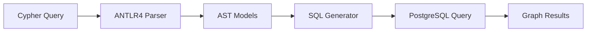

# PGraf Cypher

[](https://badge.fury.io/py/pgraf-cypher)
[](https://pypi.org/project/pgraf-cypher/)
[](https://github.com/gmr/pgraf-cypher/blob/main/LICENSE)

A Python library for translating Neo4j's Cypher query language to PostgreSQL SQL, designed to work with the [pgraf](https://github.com/gmr/pgraf) graph database toolkit.

## What is PGraf Cypher?

PGraf Cypher bridges the gap between graph databases and relational databases by enabling you to:

- **Write familiar Cypher queries** against PostgreSQL
- **Leverage existing PostgreSQL infrastructure** for graph workloads
- **Use the pgraf schema** for efficient graph data storage
- **Get native SQL performance** with graph query semantics

## Key Features

- **Complete Cypher Translation**: Supports MATCH patterns, WHERE clauses, RETURN statements, and more
- **PostgreSQL Optimized**: Generates efficient SQL that works with PostgreSQL's query planner
- **JSONB Integration**: Leverages PostgreSQL's JSONB for flexible property storage
- **Async Support**: Built for modern Python applications with async/await
- **Type Safe**: Full mypy compatibility with Pydantic models

## Quick Example

```python
from pgraf_cypher import PGrafCypher

# Translate Cypher to SQL
cypher_query = """
MATCH (u:User {email: "alice@example.com"})-[:FOLLOWS]->(friend:User)
RETURN friend.name, friend.email
ORDER BY friend.name
LIMIT 10
"""

sql, parameters = PGrafCypher.translate(cypher_query)
print(sql)
# SELECT ... FROM pgraf.nodes ... JOIN pgraf.edges ...
```

## Architecture Overview



PGraf Cypher uses ANTLR4 to parse Cypher syntax into an abstract syntax tree, then walks that tree to generate equivalent PostgreSQL SQL that operates on the pgraf schema.

## Why PGraf Cypher?

### For Graph Database Users
- Migrate from Neo4j to PostgreSQL without rewriting queries
- Use familiar Cypher syntax while gaining PostgreSQL's ecosystem
- Leverage PostgreSQL's ACID guarantees and performance

### For PostgreSQL Users
- Add graph capabilities to existing PostgreSQL databases
- Query relational and graph data in the same system
- Use proven PostgreSQL tools and monitoring

### For Application Developers
- Async/await support for modern Python applications
- Type-safe models with Pydantic
- Seamless integration with existing PostgreSQL applications

## Getting Started

1. **[Install](getting-started/installation.md)** pgraf-cypher and dependencies
2. **[Set up](getting-started/database-setup.md)** your PostgreSQL database with the pgraf schema
3. **[Try the quickstart](getting-started/quickstart.md)** to run your first query

## Community and Support

- **GitHub**: [gmr/pgraf-cypher](https://github.com/gmr/pgraf-cypher)
- **Issues**: [Report bugs or request features](https://github.com/gmr/pgraf-cypher/issues)
- **PyPI**: [pgraf-cypher package](https://pypi.org/project/pgraf-cypher/)

## License

PGraf Cypher is released under the [BSD 3-Clause License](https://github.com/gmr/pgraf-cypher/blob/main/LICENSE).
